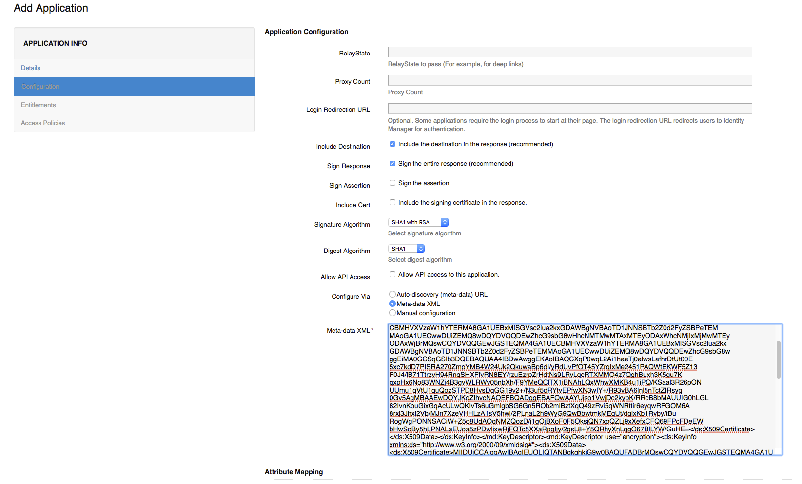

Log in with VMware Identity Manager
===================================

This demo application shows how to use Spring Boot and the Spring
security SAML2 extensions to let a user authenticate with VMware
Identity Manager™, using the SAML2 protocol.

This application is based on the [Spring SAML2 Demo application](https://github.com/vdenotaris/spring-boot-security-saml-sample)
and has been modified to integrate VMware Identity Manager as an identity provider (IdP).

Building the project
--------------------

### Prerequisites

-   You need a [VMware Identity Manager](http://www.air-watch.com/vmware-identity-manager-free-trial)
    tenant, like https://dev.vmwareidentity.asia, where you have
    **admin** access (if you want to add your own application). You can
    test the application as is, as it is configured by default on an
    provided tenant.

-   The project requires JDK 8.

### Building from IDE

-   Clone this project.

-   Then import the root folder. You can run the main class named
    `com.vmware.idm.samples.saml.Application`.

### Building from the Command Line

You can run the application locally by using

-   `$ ./gradlew bootRun`

-   Navigate to `http://localhost:8080`

Another option is to build the jar file and run it with
`./gradlew build` and
`java -jar build/libs/webapp-spring-boot-saml2.jar` (per the Spring Boot
docs and other available documentation).

You can now select the "SSO Login Page" and the first IdP and click
`Login`. You can use `user1` as username and `vmware` as the password.

### Configure the Demo Application

If you want to configure the application to log in users from your own
VMware Identity Manager organization, you need to add and configure that
SAML2 application in your Identity Manager catalog.

1.  Edit the local `./src/main/resources/application.properties`
    file to setup your organization URL:
    ```properties
    vmware.url=https://<your VMware IDM URL>
    ```
    and run the application: `$ ./gradlew bootRun.`

2.  Login to your VMware Identity Manager organization (https://<your VMware IDM URL>)) as an
    administrator

3.  Create a new SAML2 application, by clicking on the `Catalog` tab,
    and `Add Application` button, then select `...create a new one.`
    

Then edit the name, description and icon of the application. Click
`Next.`


4.  In the `Application Configuration` page, select `Meta-data XML` for
    the `Configure Via` option. And paste the XML content that you
    downloaded from your running local application:
    http://localhost:8080/saml/metadata.
    Click `Save`.
    

5.  Add the entitlements to this application. You can choose
    `Add group entitlement` and type `ALL USERS` to entitle this
    application to all users in your system.

You can now log in to your application from http://localhost:8080, and
you can also launch your application from the VMware Identity Manager
end user catalog.
